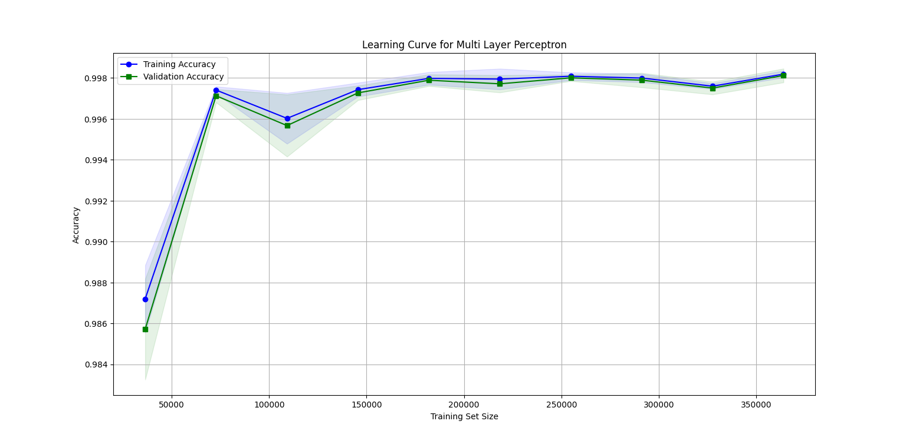
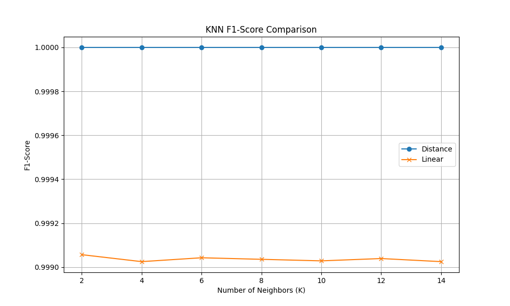
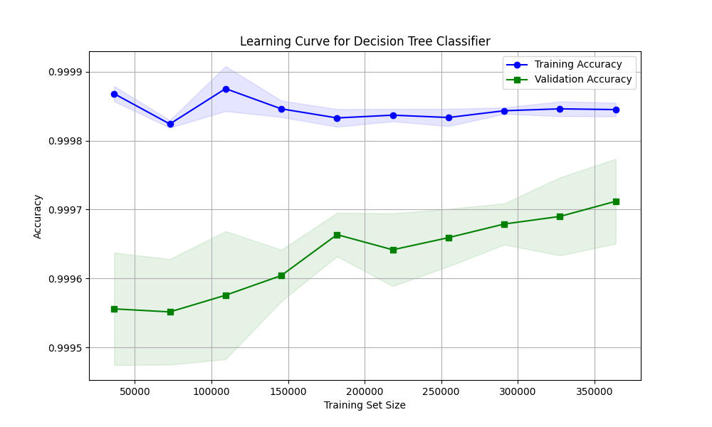

# Credit card fraud detection using machine learning

L'obiettivo di questo progetto è sviluppare e confrontare diversi modelli di machine learning per la classificazione di transazioni fraudolente, utilizzando un dataset di transazioni con carte di credito. In particolare, sono stati implementati e analizzati tre classificatori:

1. **k-Nearest Neighbors (kNN)**
2. **Multi-Layer Perceptron (MLP)**
3. **Decision Tree (DT)**

Questa analisi mira a valutare l'efficacia di ciascun modello nel rilevare attività sospette, confrontandone le prestazioni in termini di accuratezza e altre metriche di valutazione.

## Dataset

Per questo progetto, abbiamo utilizzato il dataset [Credit Card Fraud Detection Dataset 2023](https://www.kaggle.com/datasets/nelgiriyewithana/credit-card-fraud-detection-dataset-2023/discussion?sort=undefined). I dati sono stati preventivamente normalizzati per motivi di privacy e sicurezza, e le classi risultano già bilanciate. Di conseguenza, non è stato necessario applicare ulteriori tecniche di preprocessing.

## Strumenti e librerie utilizzate

Abbiamo utilizzato le seguenti librerie Python:

* [pandas](https://pandas.pydata.org/) per gestire il dataset
* [sklearn](https://scikit-learn.org/dev/index.html) e la relativa patch [sklearnex](https://github.com/uxlfoundation/scikit-learn-intelex) per implementari i classificatori
* [numpy](https://numpy.org/) e [mathplotlib](https://matplotlib.org/) per la realizzazione dei grafici

### Metriche di valutazione:

Poiché il dataset è bilanciato, abbiamo scelto di utilizzare metriche di valutazione semplici ma efficaci, come l' **accuratezza** , la **precision** e il  **recall**. In particolare:

* **Precision** : utile per valutare la capacità del modello di ridurre i falsi positivi.
* **Recall** : fondamentale per comprendere quanto bene il modello minimizzi i falsi negativi.

Queste metriche ci permettono di analizzare il bilanciamento tra falsi positivi e falsi negativi, ottimizzando così le prestazioni del classificatore.

## MLP (Multi-layer-perceptron)

Per l'addestramento del classificatore basato su MLP, abbiamo utilizzato la classe ***MLPClassifier*** della libreria ***Scikit-Learn***. Per individuare i migliori iperparametri, ci siamo avvalsi della classe ***RandomizedSearchCV***, che effettua una ricerca casuale nello spazio degli iperparametri, testando diverse combinazioni e selezionando valori casuali all'interno di un intervallo specificato dall'utente.

Il risultato migliore è stato ottenuto con i seguenti valori di ogni iperparametro:

* *hidden_layer_sizes*: (100,100)
* *activation: (ReLu)*
* *solver*: (Adam)
* *alpha*: (0.0001)
* *learning_rate*: (Constant)
* *batch_size*: (64)
* *max_iter*: (100)
* *early_stopping*: (True)
* *validation_fraction*: (0.1)
* *random_state*: (42)

Con questa configurazione, il modello ha raggiunto un'accuratezza del **99,84%** nella classificazione. Inoltre, abbiamo visualizzato l'andamento della funzione di perdita durante l'addestramento, mostrando come le prestazioni del modello siano migliorate con l'aumento delle epoche.

* Training Accuracy (blu): l'accuratezza del modello sul set di addestramento.
* Validation Accuracy (verde): l'accuratezza del modello sul set di validazione

Possiamo osservare che, all'aumentare del numero di campioni di addestramento, l'accuratezza cresce rapidamente nelle prime fasi e poi si stabilizza intorno al 99,84%, confermando la buona capacità di generalizzazione del modello. La zona d'ombra intorno alle curve rappresenta la varianza tra le diverse iterazioni dell'addestramento.

## kNN (key - Nearest - Neighbor)

Per l'addestramento del classificatore basato sull'algoritmo k-Nearest Neighbors (kNN), abbiamo utilizzato la classe *KneighborClassifier* della libreria **Scikit-Learn**. Il modello è stato testato utilizzando due approcci distinti per determinare quale metodo fosse più efficace nella classificazione dei dati.

* **Approccio Uniforme**: In questo approccio tutti i vicini hanno lo stesso peso nel determinare la classe di un punto, indipendentemente dalla loro distanza. Abbiamo testato il modello con valori del parametro *k* (numero di vicini) compresi tra 2 e 14.
* **Approccio Basato sulla Distanza**: in questo caso invece i vicini vengono pesati in base alla loro distanza dal punto da classificare. I punti più vicini hanno un peso maggiore nel determinare la classe.

Per confrontare i due approcci, abbiamo definito una funzione chiamata *compareModels*, che prende in input i seguenti parametri:

* *features*: Il vettore delle feature utilizzate per l'addestramento.
* *target*: La classe target da predire.
* *n_neighbors*: Una lista di valori per il parametro k (numero di vicini).
* *weights*: La modalità di peso da utilizzare (uniform o distance).

Il grafico mostra il confronto tra le performance del modello *kNN* utilizzando due diverse modalità di peso: uniforme e basato sulla distanza. L'asse orizzontale rappresenta il numero di vicini *k*, mentre l'asse verticale rappresenta il valore di *F1-Score*.

* **Linea Blu (Distance)**: rappresenta il valore di *F1-Score* ottenuto dal modello kNN quando i vicini vengono pesati in base alla loro distanza. I punti più vicini al punto da classificare hanno un peso maggiore.
* **Linea Arancione (Uniform)**: rappresenta il valore di *F1-Score *ottenuto dal modello kNN quando tutti i vicini hanno lo stesso peso, indipendentemente dalla loro distanza.

## DT (Decision Tree)

Per l'addestamento del classificatore basato sull'albero di decisione binario abbiamo utilizzato la classe *DecisionTreeClassifier della libreria **Scikit-Learn***. Per ottimizzare le prestazioni del modello, abbiamo utilizzato ***RandomizedSearchCV***, una tecnica di ricerca casuale degli iperparametri, valutando diverse combinazioni per migliorare il punteggio F1. La ricerca è stata effettuata con la seguente griglia di iperparametri:

1. *criterion*: ['gini', 'entropy', 'log_loss'] = Funzione di impurità utilizzata per la suddivisione dei nodi.
2. *splitter*: ['best', 'random'] =Strategia di scelta delle feature per la suddivisione.
3. *max_depth*: [10, 20, 30] = Profondità massima dell'albero.
4. *min_samples_split*: [2, 5, 10] = Numero minimo di campioni richiesti per dividere un nodo.
5. *min_samples_leaf*: [1, 2, 4] = Numero minimo di campioni in un nodo foglia

La ricerca degli iperparametri è stata eseguita utlizzando una 5 fold cross validation, utilizzando *f1* come metrica di valutazione e parallelizzando il calcolo *n_jobs = -1.*

Il modello ha raggiunto un'accuratezza sul **test set** pari a *99,97%* con questi iperparametri:

* *Criterion: gini*
* *Splitter: best*
* *Max_depth: 10*
* *Min_samples_split: 2*
* *Min_samples_leaf: 2*

Dopo aver selezionato il miglior modello, ne abbiamo valutato l'andamento utilizzando una **learning curve** che mostra il progresso della performance su training e validation set in funzione della dimensione dei dati di addestramento.

